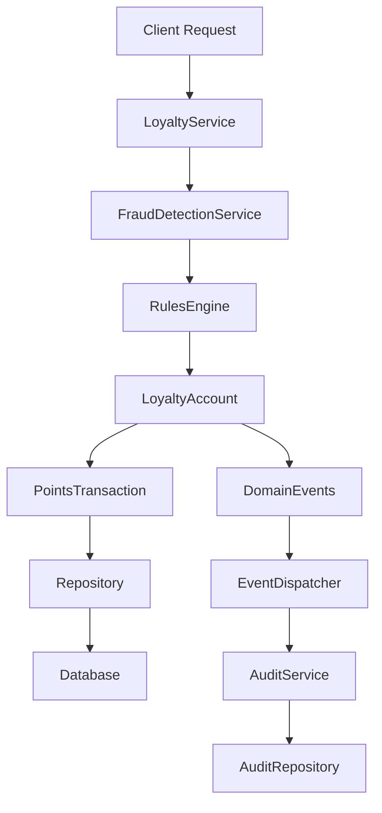

# 🏗️ Architecture Guide

## Overview

The Loyalty Rewards System is built using Domain-Driven Design (DDD) principles with a hexagonal architecture pattern. This ensures clean separation of concerns, high testability, and framework independence.

## Core Design Principles

### 1. Domain-Driven Design
- Rich domain models with behavior
- Ubiquitous language throughout codebase
- Domain events for state changes
- Business logic encapsulated in domain layer

### 2. Hexagonal Architecture
- Domain core independent of external concerns
- Infrastructure adapters for different frameworks
- Ports and adapters pattern for data access
- Dependency inversion principle

### 3. SOLID Principles
- Single Responsibility: Each class has one reason to change
- Open/Closed: Extensible through rules and policies
- Liskov Substitution: Polymorphic rule implementations
- Interface Segregation: Focused repository contracts
- Dependency Inversion: Abstractions over concretions

## Layer Breakdown

### Domain Layer (src/Domain/)

The heart of the system containing business logic and rules.

#### Models
- LoyaltyAccount: Core business entity managing customer point balances
- PointsTransaction: Immutable transaction records with full context
- Tier: Customer tier definitions with progression rules

#### Value Objects
- Points: Type-safe point calculations with validation
- Money: Multi-currency money handling with precision
- TransactionContext: Rich context for business decisions

#### Events
- PointsEarnedEvent: Triggered when points are awarded
- PointsRedeemedEvent: Triggered when points are spent
- AccountCreatedEvent: Triggered on new account creation

### Core Layer (src/Core/)

Business logic coordination and cross-cutting concerns.

#### Engine
- RulesEngine: Orchestrates multiple earning/redemption rules
- RewardCalculator: Optimized point calculation algorithms

#### Services
- LoyaltyService: Primary service for business operations
- FraudDetectionService: Real-time fraud prevention
- AuditService: Compliance and audit logging

### Rules Layer (src/Rules/)

Flexible business rule implementations using Strategy pattern.

#### Rule Types
- CategoryMultiplierRule: Different points per purchase category
- TierBonusRule: Additional bonuses based on customer tier
- TimeBasedRule: Promotional periods and special events
- CompositeEarningRule: Combines multiple rules with priorities

### Infrastructure Layer (src/Infrastructure/)

External system integrations and technical implementations.

#### Database
- Repository Implementations: PDO-based with query optimization
- Connection Factory: Multi-database support (PostgreSQL, MySQL, SQLite)
- Migration Scripts: Schema versioning and updates

#### Caching
- LoyaltyCacheManager: High-performance caching strategies
- Cache Tags: Intelligent cache invalidation

### Application Layer (src/Application/)

Use case implementations and data transfer objects.

#### Commands/Queries
- CQRS Pattern: Separate command and query responsibilities
- Command Handlers: Process business operations
- Query Handlers: Optimized data retrieval

## Design Patterns Used

### Strategy Pattern
Used extensively in the rules engine for flexible business logic:

```php
interface EarningRuleInterface
{
    public function calculatePoints(Money $amount, TransactionContext $context): Points;
    public function isApplicable(TransactionContext $context): bool;
}

class CategoryMultiplierRule implements EarningRuleInterface
{
    public function calculatePoints(Money $amount, TransactionContext $context): Points
    {
        return $amount->convertToPoints($this->baseRate)->multiply($this->multiplier);
    }
}
```

### Composite Pattern
Combines multiple rules seamlessly:
```php
class CompositeEarningRule implements EarningRuleInterface
{
    public function calculatePoints(Money $amount, TransactionContext $context): Points
    {
        $totalPoints = Points::zero();

        foreach ($this->rules as $rule) {
            if ($rule->isApplicable($context)) {
                $totalPoints = $totalPoints->add($rule->calculatePoints($amount, $context));
            }
        }
        
        return $totalPoints;
    }
}
```

### Repository Pattern
Clean data access abstraction:

```php
interface AccountRepositoryInterface
{
    public function findByCustomerId(CustomerId $customerId): LoyaltyAccount;
    public function save(LoyaltyAccount $account): void;
}
```

### Event Sourcing
All state changes generate events for audit and integration:

```php
class LoyaltyAccount
{
    public function earnPoints(Points $points, TransactionContext $context): PointsTransaction
    {
        $transaction = PointsTransaction::create(/* ... */);
        $this->recordEvent(new PointsEarnedEvent($this->id, $transaction));
        return $transaction;
    }
}
```

## Performance Architecture

### Caching Strategy
- L1 Cache: In-memory application cache for frequently accessed data
- L2 Cache: Redis/Memcached for distributed caching
- Query Result Caching: Database query optimization
- Cache Invalidation: Tag-based selective invalidation

### Database Optimization
- Proper Indexing: Optimized queries for common access patterns
- Connection Pooling: Efficient database resource usage
- Read Replicas: Separate read/write database instances
- Partitioning: Table partitioning for large transaction volumes

### Async Processing
- Queue Jobs: Background processing for heavy operations
- Event Handlers: Async event processing
- Batch Operations: Bulk transaction processing
- Circuit Breakers: Fault tolerance for external services

## Security Architecture

### Data Protection
- Input Validation: Strict validation at boundaries
- SQL Injection Prevention: Parameterized queries only
- XSS Protection: Output encoding where applicable
- Rate Limiting: API endpoint protection

### Fraud Prevention
- Multi-Layer Detection: Velocity, amount, pattern analysis
- Machine Learning Ready: Extensible for ML fraud models
- Real-time Blocking: Immediate fraud response
- Audit Trails: Complete fraud investigation support

## Extensibility Points

### Custom Rules
Create custom earning rules by implementing EarningRuleInterface:

```php
class SeasonalBonusRule extends BaseEarningRule
{
    public function calculatePoints(Money $amount, TransactionContext $context): Points
    {
        // Custom seasonal logic
    }

    public function isApplicable(TransactionContext $context): bool
    {
        // Custom applicability logic
    }
}
```

### Custom Fraud Detection
Add custom fraud detectors:

```php

class CustomFraudDetector
{
    public function analyze(LoyaltyAccount $account, Money $amount, TransactionContext $context): FraudResult
    {
        // Custom fraud detection logic
        return new FraudResult($score, $reasons);
    }
}
```

### Framework Adapters
Create adapters for different frameworks:

```php
namespace LoyaltyRewards\Adapters\Laravel;

class LaravelLoyaltyServiceProvider extends ServiceProvider
{
    public function register(): void
    {
        $this->app->singleton(LoyaltyService::class, /* ... */);
    }
}
```

## Data Flow


## Scalability Considerations

### Horizontal Scaling
- Stateless service design
- Database sharding support
- Load balancer compatible
- Microservice ready

### Vertical Scaling
- Memory efficient operations
- Connection pooling
- Query optimization
- Caching strategies

### High Availability
- Database replication support
- Circuit breaker patterns
- Graceful degradation
- Health check endpoints

## Technology Stack

- PHP 8.2+
- PSR Standards: PSR-3 Logging, PSR-14 Events, PSR-16 Caching
- Database: PostgresSQL primary, MySQL/SQLite support
- Testing: Pest PHP
- Quality: PHPStan static analysis, code formatting

This architecture ensures the loyalty rewards system can grow from small implementations to enterprise-scale deployments while maintaining code quality and performance.
